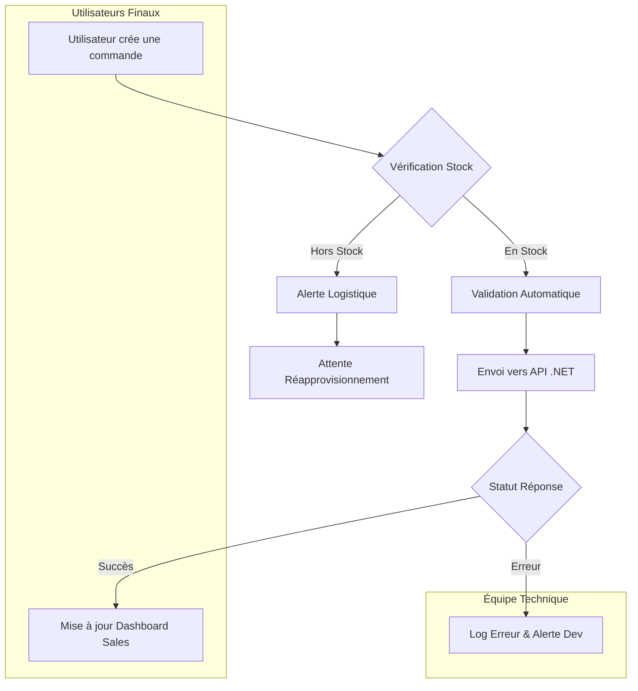

Description du flux de gestion des commandes
Ce diagramme illustre le processus de création et de traitement d’une commande, depuis l’action de l’utilisateur jusqu’à la mise à jour des outils internes, en intégrant les contrôles de stock et la gestion des erreurs techniques.

Création de la commande
Le processus débute lorsqu’un utilisateur final crée une commande dans le système.

Vérification du stock
Une étape de contrôle vérifie la disponibilité des produits :

Si le stock est disponible, la commande est validée automatiquement.
Si le stock est insuffisant, une alerte est envoyée à l’équipe logistique et la commande est mise en attente de réapprovisionnement.

Traitement côté backend
Lorsque la commande est validée, elle est transmise à une API .NET pour traitement et intégration avec les systèmes internes.

Gestion du retour de l’API
Le système analyse le statut de la réponse :

En cas de succès, le dashboard de l’équipe Sales est mis à jour afin de refléter l’état de la commande.
En cas d’erreur, un log d’erreur est généré et une alerte est transmise à l’équipe technique pour investigation.

Responsabilités par acteur

Les utilisateurs finaux interviennent lors de la création de la commande et consultent les mises à jour via le dashboard.
L’équipe technique est notifiée uniquement en cas d’erreur afin d’assurer le support et la maintenance du système.

